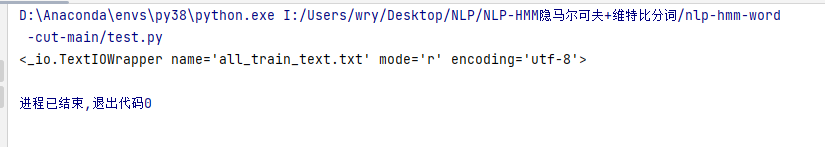
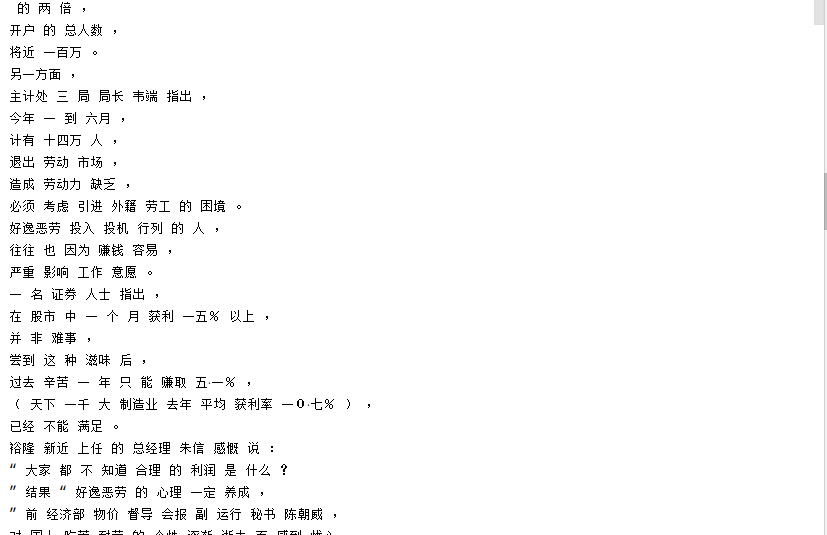
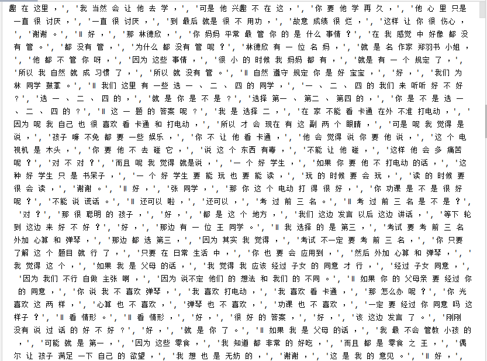
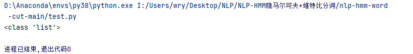
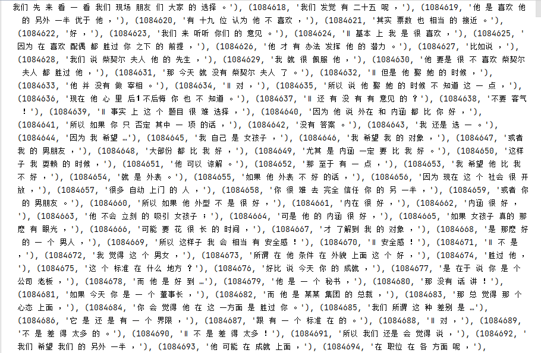

# 代码解析

## 代码1

```py
def text_to_state(file="all_train_text.txt"):
    # ...
	all_data = open(file, "r", encoding="utf-8").read().split("\n") 
    # ...
    for d_index, data in tqdm(enumerate(all_data)):
    # ...
    for w in data.split(" "):
    # ...
    
```

### 测试代码1

`open()`返回的是文件的指针地址，`.read()`返回的是字符串，`.split()`返回的是列表，列表后接`[]`表示切片操作

```py
all_data = open("all_train_text.txt", "r", encoding="utf-8")
```



```py
all_data = open("all_train_text.txt", "r", encoding="utf-8").read()
```



```py
all_data = open("all_train_text.txt", "r", encoding="utf-8").read().split("\n")
```



```py
print(type(all_data))
```



### 测试代码2

`enumerate()`函数用于将一个可遍历的数据对象（如列表、元组或字符串）组合为一个索引序列，同时列出数据和数据下标，一般用在 for 循环当中。

```py
seasons = ['Spring', 'Summer', 'Fall', 'Winter']
print(list(enumerate(seasons)))    
#输出：[(0, 'Spring'), (1, 'Summer'), (2, 'Fall'), (3, 'Winter')]
print(list(enumerate(seasons, start=1)))  
#输出：[(1, 'Spring'), (2, 'Summer'), (3, 'Fall'), (4, 'Winter')]
```

```py
print(list(enumerate(all_data)))
```



### 测试代码3

`split()`通过指定分隔符对字符串进行切片，如果参数 num 有指定值，则分隔 num+1 个子字符串

```py
str = "Line1-abcdef \nLine2-abc \nLine4-abcd";
print str.split( );       # 以空格为分隔符，包含 \n
# ['Line1-abcdef', 'Line2-abc', 'Line4-abcd']
print str.split(' ', 1 ); # 以空格为分隔符，分隔成两个
# ['Line1-abcdef', '\nLine2-abc \nLine4-abcd']
```

